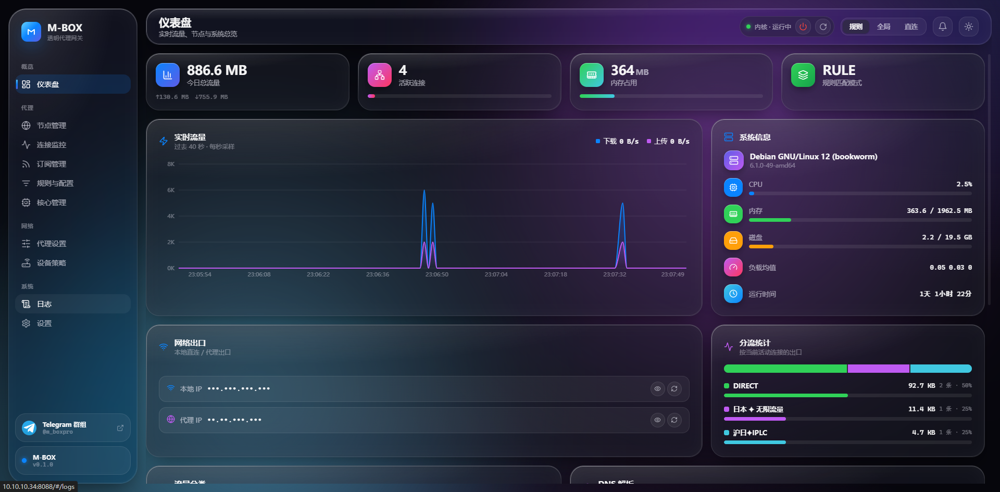
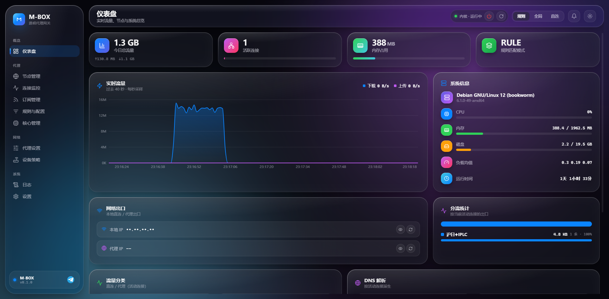

# M-BOX

<p align="right"><a href="README.md">English</a> · <b>简体中文</b></p>

> 轻量级**透明代理网关** —— 一台专职的旁路由代理盒子，自带现代化 Web 面板，开机即用。

[](https://t.me/m_boxpro)
[](LICENSE)

基于 [mihomo](https://github.com/MetaCubeX/mihomo)（Clash.Meta）内核，用一个 Go 守护进程把「内核进程管理 + 配置生成 + REST/WebSocket API + 静态面板」打包成一个二进制；前端是 React + Vite 的实时面板。把它装在一台 Linux 主机上，作为**旁路由**挂在主路由后面，给指定设备做透明代理 —— 设备无需任何客户端，只要把网关/DNS 指过来即可。

## 界面预览

| 仪表盘（亮色） | 仪表盘（暗色） |
| :---: | :---: |
|  |  |


---

## 一、它是怎么运作的

```
                ┌──────────────────────── M-BOX 主机 ────────────────────────┐
   局域网设备    │                                                            │
 (网关/DNS 指向  │   ┌── mbox daemon (Go 单二进制) ──────────────────────┐     │
   本机 IP)      │   │  · 托管 mihomo 子进程（启停/重载/崩溃自愈）        │     │
      │          │   │  · 读写 config.yaml（单一事实来源）+ 热重载        │     │
      ▼          │   │  · REST /api/* + WebSocket /ws/*（面板后端）       │     │
  所有流量 ──────┼──▶│  · 托管 React 面板静态资源（默认 :8088）           │     │
                 │   └───────────────┬───────────────────────────────────┘     │
                 │                   │ 控制 (127.0.0.1:9090 external-controller) │
                 │   ┌───────────────▼─────────── mihomo 内核 ───────────┐     │
                 │   │  TUN(mbox-tun) + auto-route + auto-redirect        │     │
   出网 ◀────────┼───│  fake-ip DNS(:53) + 分流规则(GEOIP/GEOSITE)        │────▶│──▶ 互联网/代理节点
                 │   └────────────────────────────────────────────────────┘     │
                 └────────────────────────────────────────────────────────────┘
```

核心机制：

1. **透明代理（无需客户端）**：mihomo 建一张 `mbox-tun` 三层网卡，配合 `auto-route` + `auto-redirect`（基于内核 nftables，性能优于 tproxy）+ `strict-route` 防泄漏，把经过本机转发的设备流量全部接管。设备侧只要把**网关和 DNS 指向本机 IP**，即可透明走代理。
2. **DNS 防污染**：`fake-ip` 模式 + 上游加密 DoH + `dns-hijack any:53`，从根上规避 DNS 污染与泄漏，并在解析层做去广告。
3. **单一事实来源**：所有页面（节点、规则、DNS、TUN、订阅…）都直接读写同一份 `config.yaml` 的对应片段，改完即热重载、即时生效，不存在「另一份数据库」导致的不同步。
4. **进程自愈**：daemon 以 `Pdeathsig` 绑定内核生命周期，并在启动时清理游离的残留 mihomo，杜绝多实例争抢 TUN/端口。
5. **多核**：Go 默认吃满所有 CPU 核心，配合网卡多队列，高并发下负载自动铺满多核。

## 二、实现的效果

- **仪表盘**：实时上下行流量（WebSocket）、连接数、内存/CPU/磁盘/负载、规则命中、分流统计、本地出口 IP 与代理出口 IP。
- **节点管理**：节点列表、策略组切换、批量测速、**一键自动选优**（综合延迟/抖动/丢包/倍率评分）。
- **订阅管理**：增删改订阅，自动注入 `proxy-providers` 并接入策略组，按周期自动更新。
- **规则与配置**（三合一）：分流规则增删改 + 规则集（可视化映射 config 真实规则）+ 配置源码在线编辑 / 一键推荐策略 / 备份恢复 / 导入导出。
- **代理设置**：端口、认证、运行模式、IPv6、性能优化（unified-delay / tcp-concurrent 等）、流量嗅探、GEO 数据更新。
- **设备策略**：按设备（IP/MAC）指定走代理或直连。
- **核心管理**：mihomo 内核版本检查与**在线一键更新**。
- **日志**：mihomo 内核日志 + M-BOX 后端日志，实时流、分级筛选、搜索。
- **设置**：主题（暗/亮）、系统优化（BBR / 开机自启 / IP 转发）、服务启停重启、一键诊断体检。
- **现代 UI**：macOS Liquid Glass 风格毛玻璃面板，暗/亮主题，中文 / English（顶栏一键切换）。

## 三、安装

### 环境要求

- 一台能联网的 **Linux 主机**（推荐 **Debian 12**），**root** 权限，内核支持 **TUN**。
- 物理机 / 虚拟机 / 云主机 / 容器均可（底层各异，本文不针对具体平台）。
- 架构支持 `amd64` / `arm64`。

> 提示：作为旁路由使用时，建议给它一个**固定 IP**。

### 方式 A：离线整包安装（推荐，无需 go/npm）

从 [Releases](https://github.com/ike-sh/M-BOX/releases) 下载对应架构的整包（已内置内核 / geo 数据 / 前端 / 默认配置，全程离线）：

```bash
tar -xzf mbox-v0.1.0-linux-amd64.tar.gz
cd mbox-v0.1.0-linux-amd64
sudo bash install.sh
# 自定义面板端口（默认 8088）：
# sudo MBOX_PORT=8088 bash install.sh
```

### 方式 B：源码安装

需要主机具备 `go` 与 `node/npm`（脚本会自动现场构建后端与前端）：

```bash
git clone https://github.com/ike-sh/M-BOX.git
cd M-BOX
sudo bash scripts/install.sh
# 安装时直接带上机场订阅：
# sudo MBOX_SUB_URL="https://你的订阅链接" bash scripts/install.sh
```

### 安装完成后

1. **打开面板**：浏览器访问 `http://<本机IP>:8088`。
2. **加节点**：在「订阅管理」粘贴机场订阅，或在「节点管理」手动添加。
3. **接入设备**：在你的主路由 / DHCP 里，把需要走代理的设备的**网关**和 **DNS** 指向本机 IP（其余设备不受影响）。
4. **验证**：设备能正常访问外网；用 <https://browserleaks.com/dns> 检查 DNS 无泄漏；面板「设置 → 一键诊断」体检全过。

### 常用命令

```bash
systemctl status  mbox-daemon      # 看运行状态
journalctl -u     mbox-daemon -f   # 看实时日志
systemctl restart mbox-daemon      # 重启
systemctl stop    mbox-daemon      # 停止
sudo mbox-uninstall                # 卸载并还原系统（离线包安装时已注册）
# 连同配置一起删除：sudo PURGE=1 mbox-uninstall
```

### 主要配置项（环境变量 / 命令行 flag）

| flag | env | 默认 | 说明 |
| --- | --- | --- | --- |
| `-listen` | `MBOX_LISTEN` | `0.0.0.0:8088` | 面板监听地址 |
| `-workdir` | `MBOX_WORKDIR` | `/etc/mbox` | 工作目录（含 config.yaml / geo / 前端） |
| `-mihomo` | `MBOX_MIHOMO_BIN` | `mihomo` | mihomo 可执行文件路径 |
| `-controller` | `MBOX_CONTROLLER` | `127.0.0.1:9090` | mihomo external-controller |
| `-manage` | `MBOX_MANAGE` | `1` | 是否由 daemon 托管 mihomo 子进程 |

## 四、安全提示

- mihomo 控制接口（external-controller）与本地代理端口默认**只绑 `127.0.0.1`**。
- 面板默认无鉴权（面向内网自用）；**切勿把面板/API 端口暴露到公网**，需远程访问请配合 Tailscale / WireGuard 等内网穿透。

## 五、交流与反馈

- **Telegram 群组**：<https://t.me/m_boxpro> —— 安装、配置、使用问题都可以在群里交流。
- **GitHub Issues**：发现 Bug 或有功能建议，请提 [Issue](https://github.com/ike-sh/M-BOX/issues)。

## 鸣谢

- [MetaCubeX/mihomo](https://github.com/MetaCubeX/mihomo) —— 代理内核
- [MetaCubeX/meta-rules-dat](https://github.com/MetaCubeX/meta-rules-dat) —— GeoIP / GeoSite 数据

## 许可证

本项目以 [MIT License](LICENSE) 开源，可自由使用、修改与分发。
